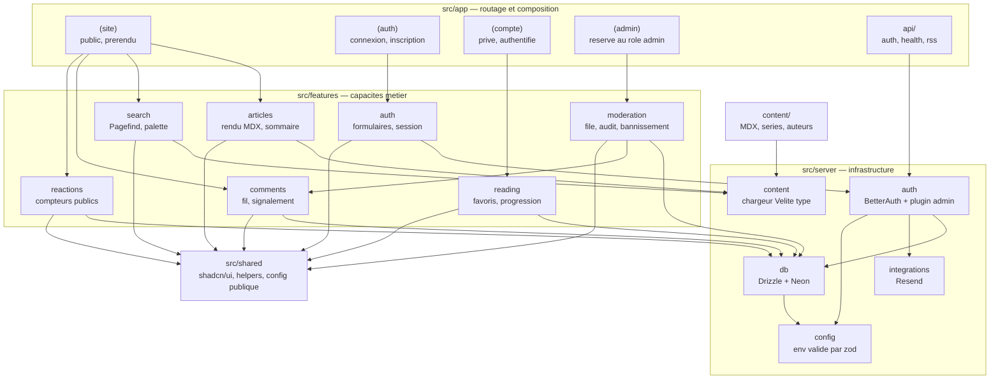

# INSTALL.md — BlueOasis

Vision technique et guide d'installation.

> Document produit par `aidd-context:01-bootstrap`, révisé lors de la revue d'architecture.
> Documentation uniquement : aucun code n'est généré ici.
> Dernière mise à jour : 2026-08-05.

## Vision

**Apprendre la tech en français, sans passer par l'anglais : des guides pratiques et des vidéos, écrits par des gens du métier.**

BlueOasis est un média communautaire francophone destiné aux développeurs, aux profils infrastructure / réseau / système, aux étudiants et aux curieux de l'informatique. Le contenu — guides, conventions, bonnes pratiques — est écrit en MDX et versionné dans le dépôt, ce qui garantit un rendu statique, un référencement fort et un coût d'hébergement quasi nul.

Le différenciateur n'est ni le volume ni la fréquence de publication : c'est **la qualité de l'expérience de lecture**. Sommaire vivant, recherche instantanée, palette de commandes, réactions optimistes, transitions fluides — un produit, pas un flux d'articles.

Cible à 6 mois : 100 à 1000 visiteurs par mois. Ce chiffre est une contrainte de conception assumée : **tout ce qui suit est dimensionné pour ce volume**, et le sur-dimensionnement est traité comme un défaut.

## Decisions

| Décision        | Choix                                                                                                 | Pourquoi                                                                                                                                                                                          |
| ---------------- | ----------------------------------------------------------------------------------------------------- | ------------------------------------------------------------------------------------------------------------------------------------------------------------------------------------------------- |
| Architecture     | **Monolithe Next.js organisé par feature**, statique par défaut, îlots dynamiques            | Solo, moins de 10 k utilisateurs, pas de temps réel. La découpe par capacité métier (et non par type technique) est la convention retenue par l'auteur du projet                              |
| Front-end        | **Next.js 16 App Router** — SSG + Cache Components, React 19, shadcn/ui, Tailwind              | Le SEO est critique : le rendu serveur/statique est non négociable, ce qui exclut une SPA. Seul framework maîtrisé par l'équipe                                                               |
| Back-end         | **Next.js** — Server Actions pour les mutations, Route Handlers pour les contrats HTTP publics | Aucun besoin de calcul lourd ni de connexions persistantes. Un second service serait une charge d'ops sans contrepartie                                                                           |
| Base de données | **PostgreSQL — Neon (Francfort)** + Drizzle ORM                                                | Données relationnelles, RGPD, résidence UE. Drizzle est léger et typé, adapté au serverless. Le contenu reste en MDX : la base ne stocke que le dynamique                                    |
| Auth             | **BetterAuth ≥ 1.6** + plugin `admin`                                                        | Imposé par l'équipe. Justifié indépendamment des commentaires : favoris et progression sont de l'état par utilisateur. Le plugin`admin` fournit rôles et bannissement pour la modération |
| Hébergement     | **Vercel `fra1` + Neon EU + Resend**                                                          | Zéro ops pour un solo, support Next.js de première partie, fonctions épinglées à Francfort pour la colocalisation avec la base et la conformité RGPD Stack summary                          |

- **Front-end :** Next.js 16.3 (App Router, `cacheComponents: true`, Turbopack) · React 19 · TypeScript · Tailwind CSS · shadcn/ui
- **Back-end :** Server Actions + Route Handlers (TypeScript), runtime Node.js
- **Base de données :** PostgreSQL sur Neon, région `aws-eu-central-1` (Francfort) · Drizzle ORM via `drizzle-orm/neon-serverless` (pool WebSocket) · `drizzle-kit` pour les migrations
- **Auth :** BetterAuth ≥ 1.6.22 (viser 1.6.26), adaptateur Drizzle avec `transaction: true`, plugin `admin` pour les rôles et le bannissement
- **Contenu :** MDX versionné dans `content/`, compilé et typé par **Velite 0.4.0** (schémas zod)
- **Recherche :** **Pagefind 1.5.x**, index généré au build depuis la sortie Velite via son API Node, exécution 100 % dans le navigateur
- **Validation :** **zod 4.x** — frontmatter, variables d'environnement, entrées des Server Actions, charges utiles des Route Handlers, schémas dérivés de la base via `drizzle-zod`
- **Interactivité UI :** `motion` · `cmdk` (palette ⌘K) · `sonner` (toasts) · `vaul` (tiroirs mobiles) · `next-themes` · View Transitions natives · `useOptimistic`
- **Hébergement :** Vercel (`"regions": ["fra1"]`) · Neon Free ou Launch · Resend palier gratuit
- **Intégrations :** YouTube (`youtube-nocookie` pour la vidéo) · Resend (emails transactionnels)
- **Domaine :** `blueoasis.yanis-harrat.com` au lancement, bascule prévue vers `blueoasis.fr` — piloté par la seule variable `NEXT_PUBLIC_SITE_URL`

## Architecture



`src/app` compose et n'implémente rien : il connaît les URL, les layouts et les métadonnées. `src/features` porte les capacités métier et n'expose que ce que son `index.ts` publie. `src/server` détient l'infrastructure et n'est jamais importé depuis un Client Component — la frontière est tenue par `import "server-only"`. `src/shared` ne dépend d'aucune feature ; dès qu'un élément y devient métier, il migre.

La différence structurante avec une application classique : **`content/` est une source de données au même titre que la base**, mais immuable au runtime. Les deux vivent au même rang dans `src/server`. Les pages d'article sont entièrement prérendues depuis `content/` ; commentaires, réactions et progression sont des îlots dynamiques rendus sous `<Suspense>`.

### Frontière statique / dynamique

C'est la décision d'architecture la plus importante du projet.

| Zone                                  | Rendu                                                   | Source                  |
| ------------------------------------- | ------------------------------------------------------- | ----------------------- |
| Page d'article, listes, séries, tags | **Prérendu au build** (`generateStaticParams`) | `content/` via Velite |
| Recherche                             | **Client**, index statique téléchargé          | Pagefind                |
| Commentaires, réactions              | **Runtime**, sous `<Suspense>`                  | Neon                    |
| Favoris, progression, paramètres     | **Runtime**, authentifié                         | Neon                    |
| Administration                        | **Runtime**, rôle `admin` requis               | Neon                    |

Conséquence pratique : publier un article demande un déploiement (c'est le choix « MDX dans le repo », assumé), mais **aucune page d'article ne dépend de la base pour s'afficher**. Si Neon est indisponible, le site reste entièrement lisible et indexable — seuls les îlots dégradent.

### Un seul îlot dynamique par page d'article

Une page d'article a besoin de quatre données runtime : le fil de commentaires, les compteurs de réactions, la réaction du lecteur courant, son état favori et sa progression.

L'écriture naïve place quatre `<Suspense>` avec quatre composants serveur autonomes. **Sur Neon avec le scale-to-zero, c'est payer le réveil de la base quatre fois** et enchaîner quatre allers-retours.

La règle : **une frontière `<Suspense>`, une requête**. Un composant `ArticleEngagement` charge tout en une fois et distribue les données en props aux composants de chaque feature. Chaque feature expose sa query unitaire *et* accepte de recevoir ses données depuis l'extérieur — elle ne va jamais les chercher elle-même quand elle est composée.

La coordination vit dans `app/`, dont c'est précisément le rôle.

### Écritures de progression de lecture

La progression s'écrit **aux seuils** — 25 / 50 / 75 / 100 % — et jamais à l'événement de défilement, avec un envoi final via `sendBeacon` à la fermeture. Quatre écritures maximum par article et par lecteur, au lieu de plusieurs centaines. C'est le poste qui grignoterait silencieusement les CU-heures Neon.

### La clé de jointure entre contenu et base

Les articles vivent dans Git, les commentaires dans Postgres. Il faut une clé stable entre les deux.

**Ne jamais utiliser le slug comme clé étrangère.** Un slug change (correction de titre, refonte SEO), et tout renommage orphelinerait les commentaires. Chaque article porte dans son frontmatter un `id` **immuable**, généré une fois à la création et jamais modifié ; le slug reste libre d'évoluer, avec une redirection.

Toutes les tables dynamiques référencent `article_id`, jamais `slug`.

### Chaîne de build en une passe

Chaque étape consomme la sortie de la précédente. Le MDX n'est lu qu'une fois.

```
1. velite build          → .velite/   (articles typés, HTML compilé, zod validé)
2. build-search-index    → lit .velite/, jamais content/  → public/pagefind/
3. next build            → lit .velite/ + public/         → sortie statique
```

Bénéfice au-delà de la vitesse : **Pagefind indexe exactement ce que Velite a validé**. Un article rejeté par le schéma zod ne peut pas apparaître dans les résultats de recherche. Une seule vérité.

Corollaire sur les images Open Graph : le frontmatter fournit déjà `image.src` en 1200×630, et le schéma zod la rend obligatoire. **Aucune génération dynamique par article** — elle allongerait le build pour reproduire une donnée déjà fournie. Seule la racine conserve un `opengraph-image.tsx`, pour les pages sans visuel propre.

## Folder structure

```text
blue-oasis/
├── content/                                  # données versionnées, hors du code
│   ├── articles/
│   │   └── architecture-par-feature-nextjs-16.mdx
│   ├── series/
│   │   └── nextjs-16-app-router.yml
│   └── authors/
│       └── yanis-amine-harrat.yml
│
├── public/
│   ├── images/articles/
│   ├── fonts/
│   └── pagefind/                             # généré au build, non versionné
│
├── src/
│   ├── app/
│   │   ├── (site)/                           # public, prérendu, SEO
│   │   │   ├── layout.tsx
│   │   │   ├── page.tsx
│   │   │   ├── articles/
│   │   │   │   ├── page.tsx
│   │   │   │   └── [slug]/
│   │   │   │       ├── page.tsx
│   │   │   │       └── loading.tsx
│   │   │   ├── series/[slug]/page.tsx
│   │   │   ├── tags/[tag]/page.tsx
│   │   │   └── auteurs/[handle]/page.tsx
│   │   │
│   │   ├── (auth)/
│   │   │   ├── layout.tsx
│   │   │   ├── connexion/page.tsx
│   │   │   ├── inscription/page.tsx
│   │   │   └── mot-de-passe-oublie/page.tsx
│   │   │
│   │   ├── (compte)/                         # privé — URLs sous /compte
│   │   │   └── compte/
│   │   │       ├── layout.tsx
│   │   │       ├── favoris/page.tsx
│   │   │       ├── lectures/page.tsx
│   │   │       └── parametres/page.tsx
│   │   │
│   │   ├── (admin)/                          # réservé au rôle admin
│   │   │   └── admin/
│   │   │       ├── layout.tsx                # garde de rôle + noindex
│   │   │       ├── page.tsx                  # tableau de bord
│   │   │       ├── commentaires/
│   │   │       │   ├── page.tsx              # file filtrable, actions groupées
│   │   │       │   └── [id]/page.tsx         # détail + fil en contexte
│   │   │       ├── signalements/page.tsx
│   │   │       ├── utilisateurs/
│   │   │       │   ├── page.tsx
│   │   │       │   └── [id]/page.tsx         # bannir, historique
│   │   │       └── journal/page.tsx          # audit, lecture seule
│   │   │
│   │   ├── api/
│   │   │   ├── auth/[...all]/route.ts        # handler BetterAuth
│   │   │   └── health/route.ts
│   │   │
│   │   ├── layout.tsx
│   │   ├── globals.css
│   │   ├── not-found.tsx
│   │   ├── global-error.tsx
│   │   ├── sitemap.ts
│   │   ├── robots.ts                         # disallow /admin, /compte
│   │   ├── opengraph-image.tsx               # racine uniquement
│   │   └── rss.xml/route.ts
│   │
│   ├── features/
│   │   ├── articles/
│   │   │   ├── components/
│   │   │   │   ├── article-body.tsx
│   │   │   │   ├── article-card.tsx
│   │   │   │   ├── article-header.tsx
│   │   │   │   ├── table-of-contents.tsx
│   │   │   │   ├── reading-progress-bar.tsx
│   │   │   │   ├── series-nav.tsx
│   │   │   │   └── mdx/                      # composants exposés au MDX
│   │   │   │       ├── code-block.tsx
│   │   │   │       ├── callout.tsx
│   │   │   │       ├── quiz.tsx
│   │   │   │       ├── diagram.tsx
│   │   │   │       └── youtube.tsx
│   │   │   ├── queries/
│   │   │   │   ├── get-article-by-slug.ts
│   │   │   │   ├── list-articles.ts
│   │   │   │   └── get-series.ts
│   │   │   ├── schemas/article.schema.ts     # frontmatter, zod via Velite
│   │   │   ├── types.ts
│   │   │   └── index.ts
│   │   │
│   │   ├── search/
│   │   │   ├── components/
│   │   │   │   ├── command-palette.tsx       # cmdk, raccourci ⌘K
│   │   │   │   ├── search-input.tsx
│   │   │   │   └── search-results.tsx
│   │   │   ├── lib/pagefind-client.ts        # import dynamique côté client
│   │   │   ├── schemas/search.schema.ts
│   │   │   └── index.ts
│   │   │
│   │   ├── engagement/
│   │   │   ├── queries/get-article-engagement.ts   # LA requête unique de l'îlot
│   │   │   ├── components/article-engagement.tsx
│   │   │   └── index.ts
│   │   │
│   │   ├── comments/
│   │   │   ├── actions/
│   │   │   │   ├── create-comment.action.ts
│   │   │   │   ├── update-comment.action.ts
│   │   │   │   ├── delete-comment.action.ts
│   │   │   │   └── report-comment.action.ts
│   │   │   ├── components/
│   │   │   │   ├── comment-thread.tsx        # Server Component
│   │   │   │   ├── comment-form.tsx          # Client Component
│   │   │   │   └── comment-item.tsx
│   │   │   ├── queries/list-comments.ts
│   │   │   ├── schemas/comment.schema.ts
│   │   │   ├── services/comment.service.ts   # règles de mise en attente auto
│   │   │   ├── types.ts
│   │   │   └── index.ts
│   │   │
│   │   ├── reactions/                        # état PUBLIC (compteurs)
│   │   │   ├── actions/toggle-reaction.action.ts
│   │   │   ├── components/reaction-bar.tsx   # useOptimistic
│   │   │   ├── queries/get-reactions.ts
│   │   │   ├── schemas/reaction.schema.ts
│   │   │   ├── types.ts
│   │   │   └── index.ts
│   │   │
│   │   ├── reading/                          # état PRIVÉ (propriétaire seul)
│   │   │   ├── actions/
│   │   │   │   ├── toggle-bookmark.action.ts
│   │   │   │   └── save-progress.action.ts
│   │   │   ├── components/
│   │   │   │   ├── bookmark-button.tsx
│   │   │   │   └── continue-reading.tsx
│   │   │   ├── queries/
│   │   │   ├── schemas/reading.schema.ts
│   │   │   └── index.ts
│   │   │
│   │   ├── moderation/
│   │   │   ├── actions/
│   │   │   │   ├── moderate-comment.action.ts
│   │   │   │   ├── bulk-moderate.action.ts
│   │   │   │   ├── resolve-report.action.ts
│   │   │   │   └── ban-user.action.ts
│   │   │   ├── components/
│   │   │   │   ├── moderation-queue.tsx
│   │   │   │   ├── comment-row.tsx
│   │   │   │   ├── bulk-action-bar.tsx
│   │   │   │   ├── report-card.tsx
│   │   │   │   └── audit-log-table.tsx
│   │   │   ├── queries/
│   │   │   ├── schemas/moderation.schema.ts
│   │   │   ├── services/moderation.service.ts
│   │   │   └── index.ts
│   │   │
│   │   └── auth/
│   │       ├── actions/
│   │       ├── components/
│   │       │   ├── sign-in-form.tsx
│   │       │   ├── sign-up-form.tsx
│   │       │   └── user-menu.tsx
│   │       ├── schemas/auth.schema.ts
│   │       └── index.ts
│   │
│   ├── server/
│   │   ├── auth/
│   │   │   ├── betterauth.ts                 # instance + plugin admin
│   │   │   ├── session.ts                    # requireUser()
│   │   │   └── guards.ts                     # requireAdmin(), à appeler partout
│   │   ├── config/
│   │   │   ├── env.ts                        # secrets serveur, validés zod
│   │   │   └── moderation.ts                 # seuils de mise en attente
│   │   ├── content/
│   │   │   ├── loader.ts                     # accès typé aux données Velite
│   │   │   └── registry.ts                   # index id ↔ slug, redirections
│   │   ├── db/
│   │   │   ├── client.ts                     # Drizzle + Pool neon-serverless
│   │   │   └── schema/
│   │   │       ├── auth.ts                   # tables BetterAuth + rôle
│   │   │       ├── comments.ts
│   │   │       ├── reactions.ts
│   │   │       ├── reading.ts
│   │   │       ├── moderation.ts             # signalements + journal d'audit
│   │   │       └── index.ts
│   │   ├── integrations/resend.ts
│   │   ├── ratelimit/                        # limitation de débit commentaires
│   │   └── observability/logger.ts
│   │
│   ├── shared/
│   │   ├── ui/                               # shadcn/ui
│   │   ├── lib/
│   │   │   ├── cn.ts
│   │   │   ├── dates.ts
│   │   │   └── slugify.ts
│   │   ├── config/
│   │   │   ├── site.ts                       # nom, URL, réseaux, navigation
│   │   │   └── public-env.ts                 # NEXT_PUBLIC_*, validées zod
│   │   └── types/
│   │
│   ├── proxy.ts                              # ex-middleware — /compte, /admin
│   └── test/
│       ├── setup.ts
│       └── factories/
│
├── scripts/
│   ├── build-search-index.ts                 # Pagefind depuis .velite/
│   └── check-orphans.ts                      # article_id en base absents du contenu
├── drizzle/                                  # migrations générées
├── drizzle.config.ts
├── velite.config.ts
├── next.config.ts                            # velite.build() programmatique
├── eslint.config.mjs
├── vercel.json                               # { "regions": ["fra1"] }
├── tsconfig.json
└── package.json
```

## Install steps

Installation manuelle : le framework ne génère aucun de ces éléments automatiquement.

1. **Créer les comptes et les ressources cloud.** Un projet Neon en région **Francfort** (`aws-eu-central-1`) ; un compte Resend avec le domaine d'envoi vérifié (SPF + DKIM) ; un projet Vercel relié au dépôt Git.
2. **Initialiser le projet Next.js 16** avec TypeScript, Tailwind, App Router et le dossier `src/`, puis initialiser shadcn/ui. Créer `vercel.json` contenant `{ "regions": ["fra1"] }` — le défaut est `iad1` (Washington), ce qui ferait traverser l'Atlantique à chaque appel authentifié.
3. **Renseigner les variables d'environnement** en local (`.env.local`) et sur Vercel : `DATABASE_URL` (chaîne *pooled* Neon), `BETTER_AUTH_SECRET`, `BETTER_AUTH_URL`, `RESEND_API_KEY`, `NEXT_PUBLIC_SITE_URL`. Faire échouer le démarrage si l'une manque, via le schéma zod de `src/server/config/env.ts`.
4. **Câbler la base :** Drizzle avec `drizzle-orm/neon-serverless` (pool WebSocket — **pas** `neon-http`), déclarer le schéma, générer et appliquer la première migration avec `drizzle-kit`.
5. **Câbler l'authentification :** instancier BetterAuth avec l'adaptateur Drizzle en `transaction: true` et le plugin `admin`, exposer `src/app/api/auth/[...all]/route.ts`, créer `src/proxy.ts` — **jamais `middleware.ts`**, qui serait ignoré silencieusement au build en Next 16 — et promouvoir manuellement le premier compte en rôle `admin` (aucune interface ne doit permettre de s'auto-promouvoir).
6. **Câbler le contenu et la recherche :** configurer Velite (schémas zod du frontmatter), appeler `velite.build()` par programme depuis `next.config.ts` (le plugin Webpack ne fonctionne pas sous Turbopack), et enchaîner le script Pagefind sur la sortie `.velite/` **avant** `next build`, pour que `public/pagefind/` soit inclus dans les fichiers statiques.
7. **Valider sur un déploiement de préversion** avant d'écrire la moindre UI : vérifier que `public/pagefind/` est bien servi en production, que l'inscription crée réellement un utilisateur, qu'une page d'article est bien prérendue, et qu'un compte sans rôle `admin` reçoit bien un 404 sur `/admin`.

## Audit summary

Résultats des audits multi-agents (actions 03, deux tours).

### Tour 1 — modèle d'hébergement

| Candidate                            | Verdict | Notes                                                                                                                                                                              |
| ------------------------------------ | ------- | ---------------------------------------------------------------------------------------------------------------------------------------------------------------------------------- |
| **A — Vercel serverless**     | ⚠️    | Retenue. Socle sain ; deux corrections obligatoires (Next 16, driver Neon). Hobby interdit l'usage commercial, Pro à ~20 $ dès monétisation                                     |
| **B — VPS auto-hébergé EU** | ⚠️    | Écartée. Coolify stable depuis avril 2026 seulement, 11 CVE critiques entre nov. 2025 et janv. 2026. Coût réel ~16–20 €/mois : toute la charge d'ops pour ~10 € d'économie |
| **C — Cloudflare edge**       | ⚠️    | Écartée. Middleware Next et`proxy.js` non supportés par OpenNext, alors que la doc BetterAuth les prescrit. Coût cognitif élevé en solo                                    |

### Tour 2 — moteur de recherche

| Candidate          | Verdict | Notes                                                                                                                                                                                                                                        |
| ------------------ | ------- | -------------------------------------------------------------------------------------------------------------------------------------------------------------------------------------------------------------------------------------------- |
| **Pagefind** | ✅      | **Retenue.** 1.5.2 (avril 2026), racinisation française automatique, zéro quota, zéro tiers, zéro sous-traitant RGPD                                                                                                               |
| Algolia            | ⚠️    | Viable mais écartée. Gratuit jusqu'à 10 000 recherches/mois — facturées**à la frappe** — et blocage dur en `403` au dépassement. Impose `force-dynamic` sur la route de recherche                                          |
| Orama              | ❌      | **Rejetée.** Mainteneur parti en février 2026, npm figé à 3.1.18 (déc. 2025), v3.2.0 jamais publiée. Bug français reproduit : `securite` ne trouve pas `sécurité`. Fumadocs a migré vers `zbsearch` le 30 juillet 2026 |

### Vérifications complémentaires

| Composant                              | Verdict | Constat                                                                                                                                                                                                        |
| -------------------------------------- | ------- | -------------------------------------------------------------------------------------------------------------------------------------------------------------------------------------------------------------- |
| **Velite**                       | ✅      | 0.4.0 (17 juin 2026), commits jusqu'au 3 août 2026. Construit sur zod. Pré-1.0 : à épingler exactement                                                                                                     |
| Content Collections                    | ✅      | 0.15.2 (16 juin 2026), vivant. Alternative crédible non retenue                                                                                                                                               |
| **BetterAuth, plugin `admin`** | ✅      | **Aucune alerte de sécurité ne le concerne.** Les failles de juin 2026 touchent `sso`, `scim`, `stripe`, `oauth-provider`, les plugins OIDC/MCP dépréciés, et le cœur (corrigé en 1.6.22) |
| Sandpack                               | ❌      | Abandonné (dernière publication février 2025) et limité à JavaScript. Écarté                                                                                                                            |
| Snippets exécutables                  | ❌      | **Hors périmètre** : la feature « interactivité » désigne l'expérience UI/UX, pas l'exécution de code                                                                                            |

### Corrections obligatoires issues des audits

| Sujet           | Correction                                                                                                                                                                                   |
| --------------- | -------------------------------------------------------------------------------------------------------------------------------------------------------------------------------------------- |
| Version Next.js | **16.x**, pas 15.x — la 15 est en fin de support le 21 octobre 2026                                                                                                                   |
| Driver base     | `drizzle-orm/neon-serverless` (pool WebSocket), **jamais** `neon-http` : pas de transactions, création d'utilisateur non atomique. Forcer `transaction: true` dans l'adaptateur |
| BetterAuth      | Épingler**≥ 1.6.22** (viser 1.6.26). En dessous, GHSA-qq9h-g4jm-xgf3 permet une prise de contrôle de compte via magic link                                                                |
| Middleware      | `src/proxy.ts` et fonction exportée `proxy`. Un `middleware.ts` résiduel est **ignoré silencieusement au build** : les routes protégées redeviennent publiques sans erreur  |
| Région Vercel  | `"regions": ["fra1"]` dans `vercel.json` — le défaut `iad1` est aux États-Unis                                                                                                      |
| Neon            | Scale-to-zero de 5 min non désactivable en palier gratuit : quelques centaines de ms de réveil. Raison de plus pour l'îlot unique. Passer en Launch si la gêne est réelle               |
| Monétisation   | Publicité, affiliation**ou dons** valent usage commercial : Hobby devient une violation des conditions, Pro (20 $/mois) obligatoire                                                   |
| Velite          | Épingler**0.4.0** exactement (pré-1.0). Le plugin Webpack ne marche pas sous Turbopack : passer par l'appel programmatique dans `next.config.ts`                                   |
| Pagefind        | Générer l'index depuis la sortie**Velite**, avant `next build`. Indexer la sortie HTML post-build est un piège connu sur Vercel (404 sur `/pagefind/`)                          |
| RGPD            | Politique de confidentialité déclarant Vercel, Neon et Resend comme sous-traitants,**ainsi que la conservation du journal de modération**. `youtube-nocookie` pour les vidéos    |

## Annexe A — Conventions de code

Reprises de la convention « architecture par feature » de l'auteur, adaptées à BlueOasis.

1. Une feature peut importer depuis `shared/`.
2. Une feature peut importer depuis `server/` **uniquement** dans du code serveur (queries, services, Server Actions) — protégé par `import "server-only"`.
3. Une feature dépend d'une autre feature **via son `index.ts` seulement**, jamais via un fichier interne.
4. `shared/` ne dépend d'aucune feature. Dès qu'un élément y devient métier, il migre vers une feature.
5. `app/` compose les features et n'absorbe jamais leur logique. Une page reste fine.
6. Les Client Components restent petits et proches de l'interaction. Le rendu et l'accès aux données restent serveur.
7. Un Route Handler n'existe que pour un **contrat HTTP public** (auth, webhooks, RSS, santé). Jamais pour une lecture interne — un Server Component appelle directement la query.
8. Les politiques de cache vivent **près de la donnée** : `"use cache"` et `cacheLife()` dans la query, pas dans une configuration globale.
9. Une feature composée dans un îlot **reçoit ses données en props** ; elle ne les recharge pas elle-même.
10. Le nommage des fichiers est en `kebab-case`, les URL sont en français, les identifiants de code en anglais.

## Annexe B — Stratégie de validation zod

zod est la **seule** source de vérité pour la forme des données, à cinq frontières :

| Frontière                 | Où                                                                                       | Ce que zod garantit                                                                                                                                                         |
| -------------------------- | ----------------------------------------------------------------------------------------- | --------------------------------------------------------------------------------------------------------------------------------------------------------------------------- |
| **Frontmatter**      | `features/articles/schemas/article.schema.ts`, via les schémas `s` de Velite         | Un article mal formé**casse le build**, jamais la production. `id` immuable, dates, tags, série, image OG obligatoire, robots                                     |
| **Environnement**    | `server/config/env.ts` (secrets) et `shared/config/public-env.ts` (`NEXT_PUBLIC_*`) | Le démarrage échoue immédiatement si une variable manque ou est malformée, au lieu d'un`undefined` en production                                                      |
| **Server Actions**   | `features/*/schemas/*.schema.ts`                                                        | Toute mutation valide ses entrées avec`safeParse` et renvoie des erreurs typées exploitables par le formulaire. **L'appel depuis l'UI n'est jamais une garantie** |
| **Route Handlers**   | idem                                                                                      | Les charges utiles publiques sont validées avant tout traitement                                                                                                           |
| **Base de données** | `drizzle-zod`, dérivé de `server/db/schema/`                                        | Les schémas d'insertion et de sélection descendent de la table : une colonne modifiée casse la compilation, pas le runtime                                               |

Règle : un schéma est déclaré **une fois**, dans la feature propriétaire, puis dérivé (`.pick()`, `.omit()`, `.extend()`). Aucun schéma n'est dupliqué entre le client et le serveur.

## Annexe C — Modèle de données

Le contenu vit dans Git ; la base ne stocke que ce qui ne peut pas y vivre.

| Table                                                | Rôle                                           | Clés et particularités                                                                                                       |
| ---------------------------------------------------- | ----------------------------------------------- | ------------------------------------------------------------------------------------------------------------------------------ |
| `user`, `session`, `account`, `verification` | Gérées par BetterAuth                         | Le plugin`admin` ajoute `role`, `banned`, `banReason`, `banExpires`                                                  |
| `comment`                                          | Commentaires, fil et modération                | `article_id`, `user_id` **nullable** (anonymisation), `parent_id` auto-référencé, `status`, `anonymized_at` |
| `reaction`                                         | Likes et réactions —**état public**    | Unicité sur (`user_id`, `article_id`, `type`)                                                                           |
| `bookmark`                                         | Favoris —**état privé**                | Clé primaire composite (`user_id`, `article_id`)                                                                          |
| `reading_progress`                                 | Progression et reprise —**état privé** | (`user_id`, `article_id`), pourcentage, `last_seen_at`                                                                   |
| `comment_report`                                   | Signalements émis par les lecteurs             | `comment_id`, `reporter_id`, motif, `status`                                                                             |
| `moderation_log`                                   | Journal d'audit,**en ajout seul**         | `actor_id`, action, type et identifiant de cible, motif, horodatage                                                          |

Points de vigilance :

- **`article_id` n'est jamais le slug** — voir « La clé de jointure entre contenu et base ». Le slug peut changer ; l'`id` du frontmatter, jamais.
- **Aucune contrainte d'intégrité référentielle possible vers le contenu** : Postgres ignore l'existence des articles. `scripts/check-orphans.ts` vérifie au build que tout `article_id` référencé en base existe encore dans `content/`.
- **`reactions` et `reading` restent deux features séparées** malgré une forme technique identique, parce qu'elles diffèrent sur la seule chose qui compte : la visibilité. Les compteurs de réactions sont publics, les favoris et la progression n'appartiennent qu'à leur propriétaire. Deux jeux de règles d'autorisation qu'on ne doit pas pouvoir mélanger par accident.

## Annexe D — Modération et administration

### Modèle retenu : post-modération

Le commentaire s'affiche immédiatement — une conversation validée douze heures plus tard n'existe pas. Le traitement se fait derrière, via l'interface d'administration.

| État         | Signification                                                              |
| ------------- | -------------------------------------------------------------------------- |
| `published` | Visible. État par défaut                                                 |
| `pending`   | Retenu automatiquement, invisible, en attente de verdict                   |
| `hidden`    | Masqué par modération.**Conservé** pour l'audit, jamais supprimé |
| `deleted`   | Supprimé par son auteur. Pierre tombale dans le fil                       |

**Mises en attente automatiques**, implémentées dans `comment.service.ts`, seuils dans `server/config/moderation.ts` : premier commentaire d'un compte · compte créé depuis moins de N minutes · plus de N liens · seuil de signalements atteint.

Une **limitation de débit** sur la création de commentaires est obligatoire : sans elle, la file de modération devient inutilisable dès le premier bot.

### Les cinq règles de sécurité de la zone admin

1. **Le rôle se vérifie dans chaque Server Action et chaque query — jamais uniquement dans le layout.** Un layout est de l'affichage ; une Server Action est un endpoint HTTP appelable directement. C'est exactement le motif des alertes BetterAuth de juin 2026 : un endpoint sans contrôle de rôle à côté de dix endpoints protégés. `requireAdmin()` vit dans `server/auth/guards.ts` et s'appelle partout.
2. **`proxy.ts` est une redirection rapide, pas une autorisation.** Il constate la présence d'un cookie. Il ne consulte pas la base et ne connaît aucun rôle.
3. **`/admin` et `/compte` en `disallow` dans `robots.ts`**, plus `noindex` sur les layouts correspondants.
4. **Chaque mutation de modération écrit dans `moderation_log`**, en ajout seul : qui, quoi, sur quoi, pourquoi, quand.
5. **Aucune cible n'est acceptée sur parole.** L'identifiant venant du client est validé par zod, puis relu en base avec vérification du droit, avant toute écriture.

Le premier compte administrateur est promu **manuellement en base**. Aucune interface ne doit permettre l'auto-promotion.

### Suppression de compte (RGPD)

Choix retenu : **anonymiser l'auteur, conserver le texte, purger sur demande explicite.**

| Donnée                                | Traitement à la suppression du compte                                                                    |
| -------------------------------------- | --------------------------------------------------------------------------------------------------------- |
| `comment`                            | `user_id = NULL`, `anonymized_at = now()`. **Texte conservé**, affiché « Compte supprimé » |
| `reaction`                           | Supprimée — les compteurs se décrémentent, ce qui est le comportement correct                         |
| `bookmark`                           | Supprimé                                                                                                 |
| `reading_progress`                   | Supprimé                                                                                                 |
| `comment_report` émis par le compte | Anonymisé                                                                                                |
| `moderation_log`                     | **Conservé** — l'acteur y est un administrateur, et c'est la preuve de conformité                |

**Sur demande explicite de purge :** les lignes de commentaires sont réellement supprimées et remplacées par une pierre tombale dans le fil, pour que les réponses gardent leur sens.

⚠️ Si le compte supprimé était la *cible* d'une action de modération, `moderation_log` en conserve la trace. C'est légitime, mais **doit être déclaré explicitement dans la politique de confidentialité**. Un traitement non déclaré est un traitement illicite.

## Prochaines étapes

Ce document fige l'architecture. La suite du parcours AIDD :

1. `aidd-context:02-project-memory` — enregistrer ces décisions dans la mémoire projet et les câbler aux outils IA.
2. `aidd-dev:01-plan` — découper la première feature en phases livrables.
