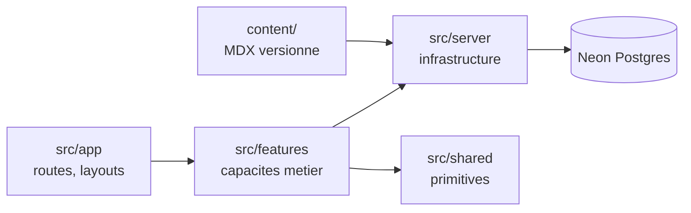

# Architecture

The macro technical shape: the stack, how the pieces fit, and the decisions behind them. Point to the code, do not restate it.

Les versions et paliers exacts vivent dans [`../INSTALL.md`](../INSTALL.md), jamais ici.

## Stack

- **TypeScript** sur **Next.js App Router**, rendu statique par défaut. Le SEO est critique : une SPA était exclue d'entrée.
- Monolithe **organisé par feature** : le code se range par capacité métier, jamais par type technique.
- **zod** comme validation transverse (voir « Décisions clés »).
- Les bibliothèques propres à une capacité (ORM, auth, UI) vivent dans leur fichier de mémoire.

## How it fits together

## Key decisions

- **Deux sources de données, pas une.** `content/` est immuable au runtime et connue au build ; Postgres est mutable et inconnue au build. Les deux vivent au même rang sous `src/server`. Ce n'est pas « la vraie base plus des fichiers à côté ».
- **Frontière statique / dynamique inversée par rapport à une application.** Les pages d'article sont entièrement prérendues depuis `content/` ; commentaires, réactions et progression sont des îlots sous `<Suspense>`. **Conséquence : si la base est indisponible, le site reste lisible et indexable.**
- **Un seul îlot dynamique par page d'article.** Quatre données runtime sont nécessaires ; les charger en quatre `<Suspense>` autonomes paierait le réveil de la base quatre fois. Une frontière, une requête : `features/engagement` porte la requête composée et distribue les données en props.
- **Une feature composée reçoit ses données en props**, elle ne les recharge jamais elle-même.
- **zod est la source unique de vérité pour la forme des données**, à cinq frontières : frontmatter, variables d'environnement, entrées des Server Actions, charges utiles des Route Handlers, schémas dérivés de la base. Un schéma est déclaré **une fois** dans sa feature propriétaire, puis dérivé — jamais dupliqué entre client et serveur.
- **Le contenu est typé au build.** Velite compile le MDX et valide le frontmatter par zod : un article mal formé casse le build, jamais la production.
- **La recherche est statique et côté client.** L'index est produit au build ; aucun service de recherche, aucun quota, aucun sous-traitant supplémentaire.
- **Publier un article demande un déploiement.** C'est le prix assumé du choix « MDX dans le dépôt », et la contrepartie du rendu statique. La chaîne concrète vit dans [`deployment.md`](deployment.md).

## Gotchas

- **`src/server` n'est jamais importé depuis un Client Component.** La frontière est tenue par `import "server-only"`, pas par la discipline.
- **Une feature n'importe jamais un fichier interne d'une autre feature** — uniquement son `index.ts`.
- **`src/shared` ne dépend d'aucune feature.** Dès qu'un élément y devient métier, il migre.
- **`src/app` compose et n'implémente pas.** Une page qui grossit est le signe d'une feature à extraire.
- **Velite est pré-1.0 : épingler la version exacte.** Son plugin Webpack ne fonctionne pas sous Turbopack (le défaut de Next 16) — il faut l'appel programmatique dans `next.config.ts`.
- Les politiques de cache vivent **près de la donnée** (`"use cache"`, `cacheLife()` dans la query), jamais dans une configuration globale.
