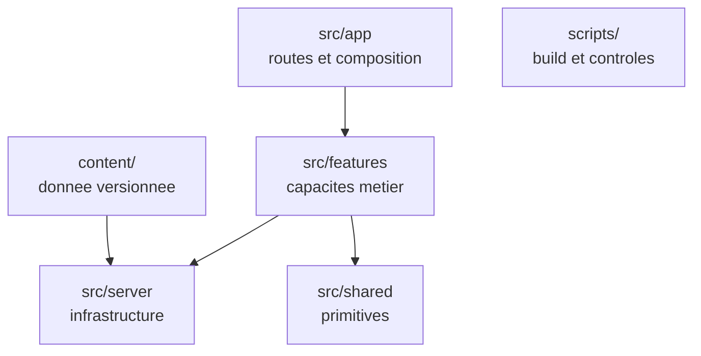

# Codebase Map

The macro layout: the top-level areas and what each holds. A map to navigate, not the full tree.

L'arborescence complète vit dans [`../INSTALL.md`](../INSTALL.md). Ici, seulement les zones.

## Areas

- `content/` : articles MDX, séries, auteurs. **Hors de `src/`** — c'est de la donnée, pas du code.
- `src/app` : routes, layouts, métadonnées, Route Handlers publics. Compose, n'implémente pas.
- `src/features` : une capacité métier par dossier, chacune avec sa surface publique en `index.ts`.
- `src/server` : les deux sources de données (`content/`, `db/`), l'auth, les intégrations, la config validée, la limitation de débit.
- `src/shared` : composants shadcn/ui, helpers, config publique du site. Ne dépend d'aucune feature.
- `scripts/` : génération de l'index de recherche, contrôle des `article_id` orphelins.
- `drizzle/` : migrations générées. Jamais éditées à la main.

## Features

- `articles` — rendu MDX, sommaire, séries, cartes.
- `search` — client Pagefind et palette de commandes.
- `engagement` — la requête composée de l'îlot dynamique, et rien d'autre.
- `comments` — fil, publication, signalement, règles de mise en attente.
- `reactions` — compteurs publics et bascule optimiste.
- `reading` — favoris, progression, reprise. **État privé.**
- `moderation` — file, actions groupées, bannissement, journal d'audit.
- `auth` — formulaires, session, menu utilisateur.

`reactions` et `reading` ont la même forme technique mais restent séparées : les compteurs sont publics, les favoris et la progression ne le sont pas. Deux jeux d'autorisation qu'on ne doit pas pouvoir confondre.

## Entry points

- `src/app/layout.tsx` — la racine de l'application.
- `src/proxy.ts` — s'exécute avant le rendu. **Jamais `middleware.ts`** : en Next 16, un fichier resté sous l'ancien nom est ignoré silencieusement au build, et les routes protégées redeviennent publiques sans aucune erreur.
- `next.config.ts` — déclenche aussi la compilation du contenu.
- `src/app/api/auth/[...all]/route.ts` — la surface HTTP de l'authentification.
