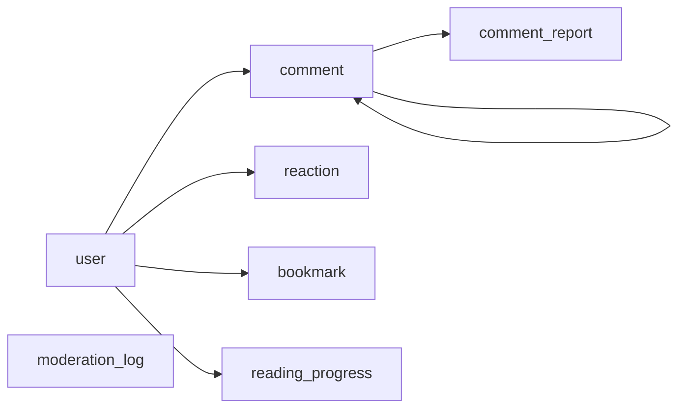

# Database

The data store: its type, the main entities, and the conventions. The macro model, not the full schema.

## Setup

- **PostgreSQL sur Neon**, région Francfort — résidence UE, exigée par le RGPD.
- **Drizzle ORM**, client dans `src/server/db/client.ts`, schéma dans `src/server/db/schema/`.
- **Le driver WebSocket (`neon-serverless`) est obligatoire, pas le driver HTTP.** Ce dernier ne gère pas les transactions, ce qui rend la création d'un utilisateur non atomique — l'inscription échoue ou laisse des lignes orphelines. L'adaptateur d'auth doit également activer les transactions explicitement : le défaut ne les active pas.
- La base ne stocke **que le dynamique**. Les articles vivent dans `content/` — voir [`architecture.md`](architecture.md).

## Main entities

- **`user`** et ses tables de session sont gérées par la bibliothèque d'auth. Voir [`auth.md`](auth.md).
- **`comment`** — fil auto-référencé par `parent_id`, avec un état de modération.
- **`reaction`** — état **public**, unique par (utilisateur, article, type).
- **`bookmark`**, **`reading_progress`** — état **privé**, clé composite (utilisateur, article).
- **`comment_report`** — signalements émis par les lecteurs.
- **`moderation_log`** — journal d'audit **en ajout seul**. Jamais modifié, jamais purgé.

## Conventions

- **`article_id` est la seule clé de jointure vers le contenu, et ce n'est jamais le slug.** Un slug change — correction de titre, refonte SEO — et tout renommage orphelinerait les commentaires. L'`id` du frontmatter est immuable, généré une fois à la création.
- **Aucune contrainte d'intégrité référentielle n'est possible vers le contenu** : Postgres ignore l'existence des articles. `scripts/check-orphans.ts` vérifie au build que tout `article_id` référencé existe encore dans `content/`.
- Migrations générées par `drizzle-kit` dans `drizzle/`, versionnées, jamais éditées à la main.
- Les schémas d'insertion et de sélection sont **dérivés des tables** via `drizzle-zod` : une colonne modifiée casse la compilation, pas le runtime.
- **`user_id` est nullable sur `comment`** : c'est le support de l'anonymisation RGPD décrite dans [`auth.md`](auth.md).

## Gotcha

Le palier gratuit de Neon met la base en veille après quelques minutes et **cela ne se désactive pas**. Chaque réveil coûte quelques centaines de millisecondes. C'est la raison technique de l'îlot unique décrit dans [`architecture.md`](architecture.md) : multiplier les requêtes multiplierait les réveils.
