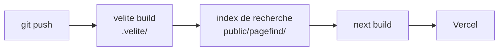

# Deployment

Where the project runs and how it ships: CI/CD, environments, and release.

## Pipeline

Le build se fait **en une seule passe de lecture du contenu** : chaque étape consomme la sortie de la précédente.

- **L'index de recherche se génère depuis la sortie compilée du contenu, pas depuis les sources**, et **avant** le build Next — sinon les fichiers d'index ne sont pas inclus dans les statiques servis en production. Indexer le HTML produit après le build est un piège connu sur cette plateforme.
- Bénéfice au-delà de la vitesse : l'index ne contient que ce que la validation a accepté. Un article rejeté ne peut pas apparaître dans les résultats.
- La compilation du contenu est déclenchée **par programme depuis `next.config.ts`**. Le plugin Webpack de l'outil ne fonctionne pas avec le bundler par défaut de Next 16.
- Un `git push` sur `main` déclenche le déploiement.

## Environments

- **Production** — `blueoasis.yanis-harrat.com`, bascule prévue vers `blueoasis.fr`. Le domaine est piloté par la **seule** variable `NEXT_PUBLIC_SITE_URL` : rien n'est en dur, ni canoniques, ni sitemap, ni métadonnées de partage.
- **Préversions** — un déploiement par branche.
- Les fonctions serveur sont **épinglées à Francfort**, pour la colocalisation avec la base et la conformité RGPD. La région par défaut de la plateforme est aux États-Unis : sans épinglage, chaque appel authentifié traverse l'Atlantique.
- Les variables d'environnement sont **validées par zod au démarrage** (`src/server/config/env.ts`) : une variable manquante fait échouer le lancement au lieu de produire un `undefined` en production.

## Release

- Pas de versionnement sémantique : le produit est un site, pas une bibliothèque. La branche `main` est l'état de production.
- Retour arrière : redéploiement instantané d'une version antérieure depuis la plateforme.

## Gotcha — monétisation

Le palier gratuit de l'hébergeur **interdit l'usage commercial**, et ses conditions rangent la publicité, l'affiliation **et les dons** dans cette catégorie. Le jour où BlueOasis monétise, même par un simple bouton de don, il faut basculer sur l'offre payante — sinon le site est en infraction avec les conditions d'utilisation.

## Monitoring

- Journalisation applicative dans `src/server/observability/logger.ts`.
- Sonde de disponibilité exposée sur `/api/health` — voir [`api.md`](api.md).
- Aucun outil de supervision externe à ce jour. À décider si le trafic le justifie.
