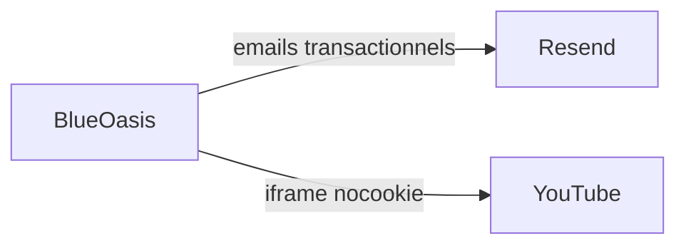

# Integration

How this system integrates with external/third-party services.

## External services

- **Resend** — emails transactionnels : vérification d'adresse, réinitialisation de mot de passe, notifications de modération. Point d'intégration : `src/server/integrations/resend.ts`. Le domaine d'envoi doit être vérifié (SPF + DKIM), sinon tout part en indésirable.
- **YouTube** — hébergement vidéo, intégré en `youtube-nocookie`. Aucune vidéo n'est hébergée par le projet : c'était un arbitrage de coût assumé.

L'hébergeur de base de données appartient à [`database.md`](database.md), la plateforme de déploiement à [`deployment.md`](deployment.md). Ils ne sont pas répétés ici.

## RGPD

Tout service listé ici est un **sous-traitant** au sens du RGPD et doit être nommé dans la politique de confidentialité, aux côtés de l'hébergeur et de la base. La liste des sous-traitants n'est pas optionnelle : un traitement non déclaré est un traitement illicite.
