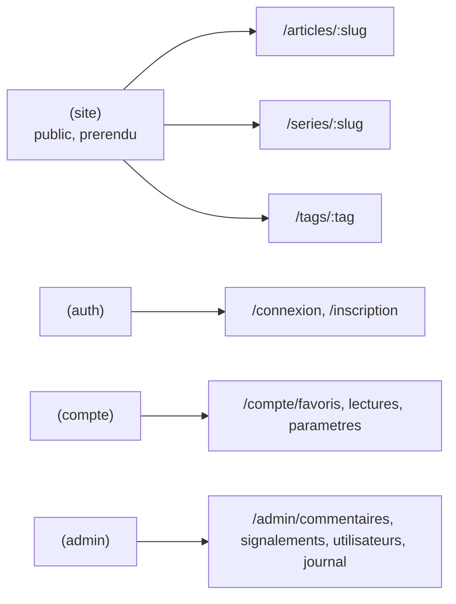

# Navigation

How the user moves through the app: routing and the page structure.

## Routing

- **Next.js App Router.** Les dossiers de `src/app` définissent les segments d'URL. Les routes sont regroupées par **route groups**, qui n'ajoutent aucun segment.
- **Les URL sont en français**, les identifiants de code en anglais. `connexion`, `favoris`, `parametres`, `commentaires`.
- Un route group exprime une **expérience de navigation** (un layout, une garde), pas une capacité métier.
- `src/proxy.ts` protège `/compte/:path*` et `/admin/:path*`. **C'est une redirection rapide, pas une autorisation** : il constate la présence d'un cookie, ne consulte pas la base et ne connaît aucun rôle. L'autorisation réelle est décrite dans [`auth.md`](auth.md).
- `/admin` et `/compte` sont en `disallow` dans `robots.ts`, et leurs layouts portent `noindex`.

## Structure

## Attention

Un route group **n'ajoute pas de segment d'URL**. Pour servir `/compte/favoris`, le chemin est `(compte)/compte/favoris/page.tsx` : le segment `compte` doit exister en plus du groupe. Sans lui, l'URL serait `/favoris`, mêlée aux URL publiques, et le `matcher` du proxy deviendrait une liste à maintenir. Même règle pour `/admin`.
